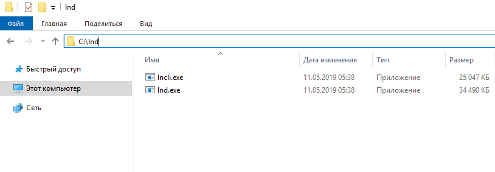
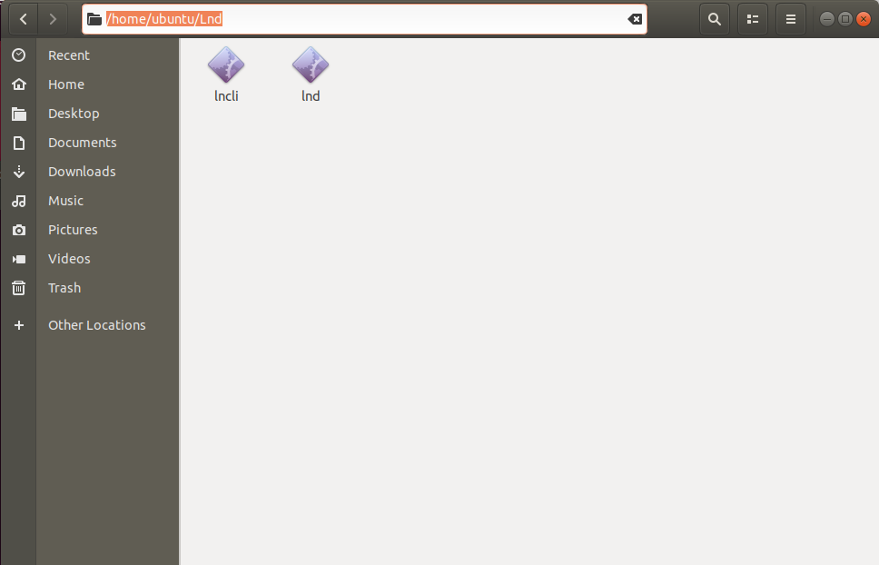

To use Litecoin ligthning network, you need 

https://github.com/litecoinfinance/lnd - Lightning Network Daemon

https://github.com/litecoinfinance/litecoinfinance - Litecoin Finance full node (core wallet)


Download binnary from release tag's


Wallet <br>


lnd <br>

<br>
Install wallet

Go to data folder

Windows
```
C:\Users\YourUserName\AppData\Roaming\litecoinfinance
```
Linux
```
/home/YourUserName/.litecoinfinance
```
MAC OS 
```
HDD/Users/YourUserName/Library/Application Support/litecoinfinance/ 
```
( if you no see Library folder, at username folder click View > Show View Options > choise Show Library Folder )

Create litecoinfinance.conf and put there this

```
rpcuser=user( make own)
rpcpassword=password (make own)
server=1
listen=1
daemon=1
txindex=1
rpcallowip=127.0.0.1 Allow rpc request from Localhost
rpcport=39327
rpcthreads=8
rpcworkqueue=4096
dbcache=4096
maxmempool=4096
maxorphantx=4096
blockreconstructionextratxn=4096
maxreceivebuffer=4096
maxsendbuffe=4096
datacarrier=4096
datacarriersize=4096
maxconnections=100
zmqpubrawblock=tcp://127.0.0.1:28332
zmqpubrawtx=tcp://127.0.0.1:28333
deprecatedrpc=signrawtransaction
discardfee=0.00000001
mintxfee=0.00000001
minrelaytxfee=0.00000001
```
Now run wallet and wait full sync

Then unpack lnd binary files for your os.

Example

Windows
<br>

<br>
Linux
<br>

<br>
MAC OS
<br>

<br>

Now we need go to default folder lnd and create conf file at that folder.


Windows go to 
```
C:\Users\YourUserName\AppData\Local\ and create folder lnd
```
Linux go to
```
/home/YourUserName/ and create folder .lnd
```
MAC OS go to
```
HDD/Users/YourUserName/Library/Application Support/ and create folder lnd
```
( if you no see Library folder, at username folder click View > Show View Options > choise Show Library Folder )


No create at that folder lnd.conf

and put there 
```
litecoinfinance.active=1
litecoinfinance.mainnet=1
debuglevel=debug
litecoinfinance.node=litecoinfinanced
litecoinfinanced.rpcuser=user ( RPC user from litecoindfinance wallet)
litecoinfinanced.rpcpass=password ( RPC password from litecoindfinance wallet)
litecoinfinanced.zmqpubrawblock=tcp://127.0.0.1:28332
litecoinfinanced.zmqpubrawtx=tcp://127.0.0.1:28333
externalip=127.0.0.1:9735 ( external ip of your lnd node )
litecoinfinanced.rpchost=127.0.0.1:39327 (ip:port for connect to RPC)
alias=MyWindows_node ( name of your node )
color=#D11711 ( color of node , there is RED)
```

Now open 2 terminals depend at your system and go to folders with lnd and lncli.

Run lnd node

Windows
```
lnd and push enter
```
Linux
```
./lnd and push enter
```
MAC OS
```
./lnd and push enter
```
Now go to another terminal and put

Windows
```
lncli --network mainnet --chain litecoinfinance create
```
Linux
```
./lncli --network mainnet --chain litecoinfinance create
```
MAC OS
```
./lncli --network mainnet --chain litecoinfinance create
```
choise password , bakup seed's and wait full sync node.

