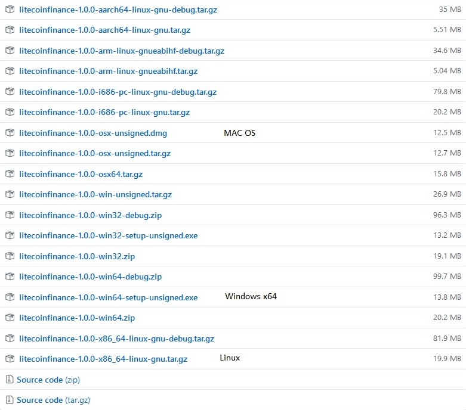
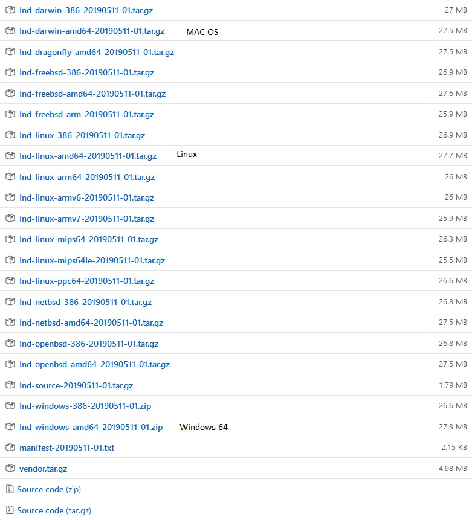

To use Litecoin ligthning network, you need 

https://github.com/litecoinfinance/lnd - Lightning Network Daemon

https://github.com/litecoinfinance/litecoinfinance - Litecoin Finance full node (core wallet)


Download binnary from release tag's


Wallet <br>



lnd <br>

<br>
Install wallet

Go to data folder

Windows
```
C:\Users\YourUserName\AppData\Roaming\litecoinfinance
```
Linux
```
/home/YourUserName/.litecoinfinance
```
MAC OS 
```
~/Library/Application Support/litecoinfinance/
```

Create litecoinfinance.conf and put there this

```
rpcuser=user( make own)
rpcpassword=password (make own)
server=1
listen=1
daemon=1
txindex=1
rpcallowip=127.0.0.1 Allow rpc request from Localhost
rpcport=39327
rpcthreads=8
rpcworkqueue=4096
dbcache=4096
maxmempool=4096
maxorphantx=4096
blockreconstructionextratxn=4096
maxreceivebuffer=4096
maxsendbuffe=4096
datacarrier=4096
datacarriersize=4096
maxconnections=100
zmqpubrawblock=tcp://127.0.0.1:28332
zmqpubrawtx=tcp://127.0.0.1:28333
deprecatedrpc=signrawtransaction
discardfee=0.00000001
mintxfee=0.00000001
minrelaytxfee=0.00000001
```
Now run wallet and wait full sync

Then unpack lnd binary files for your os.

Example

Windows

Linux

MAC OS
